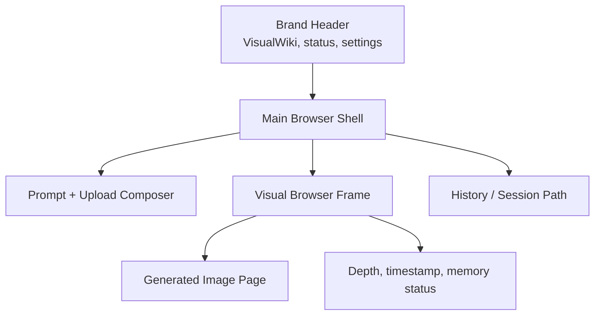
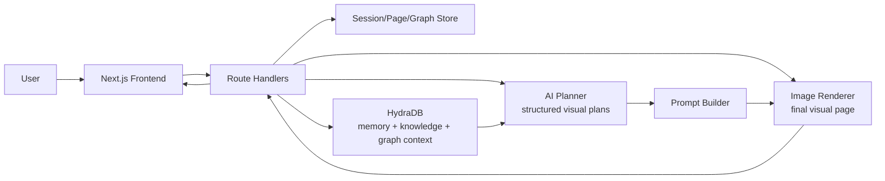
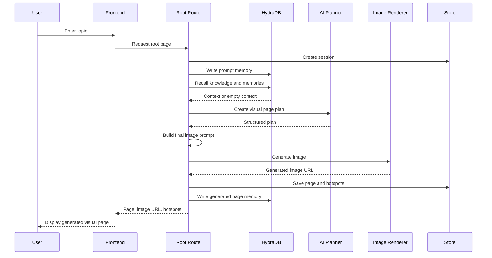
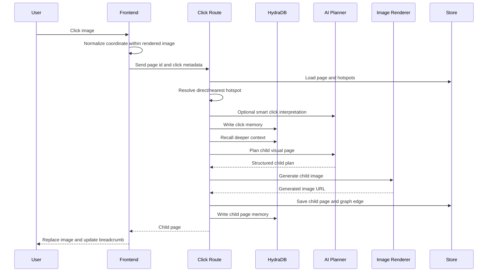
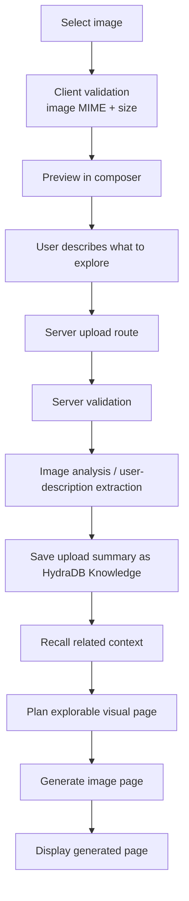
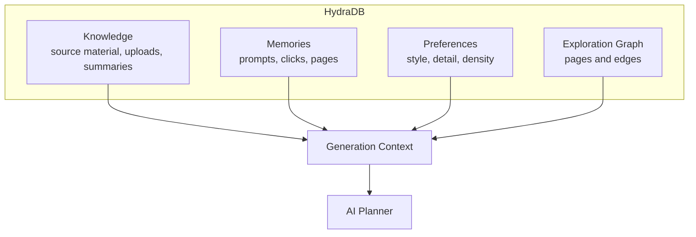
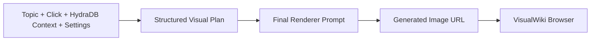
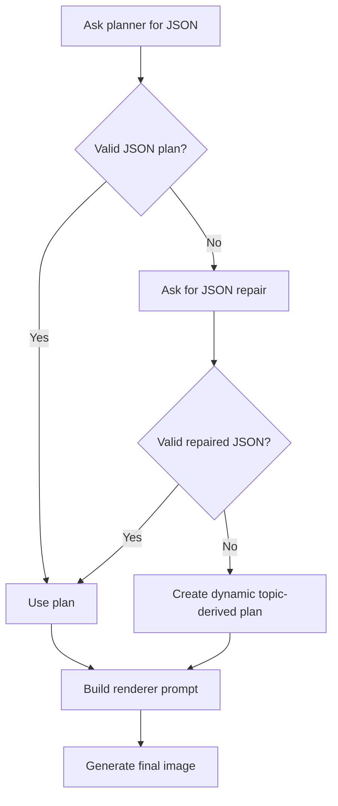
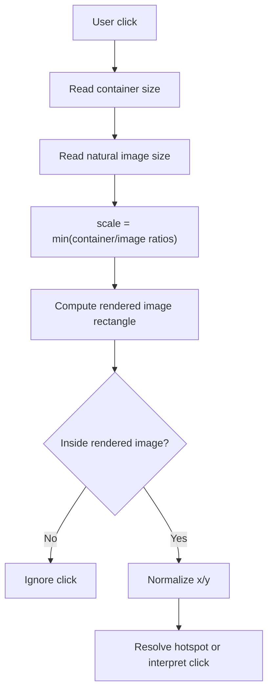

# VisualWiki


VisualWiki is an infinite AI-generated visual browser. Every page is a generated 16:9 image, and every click on that image opens a deeper generated visual page.

The product idea is simple:

```text
your idea -> generated visual page -> click any region -> deeper generated visual page -> keep exploring
```

VisualWiki is not a normal document viewer. It is an image-first knowledge browser: the content page is pixels, while the app frame provides navigation, memory, settings, upload, history, and export.

## What It Does

- Turns a prompt into a generated visual explainer page.
- Lets users click anywhere on the generated image.
- Maps the click to a concept or region.
- Recalls relevant context from HydraDB.
- Plans the next deeper visual page.
- Generates a new image page.
- Stores the exploration path as a session graph.
- Exports the current path/session for sharing or review.

## Product Principles

1. Every explorable page is a generated image.
2. UI controls are outside the knowledge page.
3. HydraDB stores memory, knowledge, preferences, and graph context.
4. The planner decides what should be visualized.
5. The renderer creates the final image.
6. Failed generation shows a retryable error, not a fake local page.
7. Uploaded images are validated and treated according to mode.
8. Reference content is never copied unless explicitly used as source context.

## Current Demo

```bash
npm install
npm run dev
```

Open:

```text
http://127.0.0.1:3000
```

Production build:

```bash
npm run build
npm start
```

## UI Overview

VisualWiki uses a compact browser-like interface:

- Brand header with logo, status, settings, and new-session control.
- Unified prompt/upload composer.
- Browser frame around the generated image.
- Breadcrumb/search pill inside the visual frame.
- Export and share controls.
- Click marker and floating status bubble.
- History panel for generated pages.
- Settings panel for generation behavior.



## High-Level Architecture



## Runtime Flow

### Prompt Start



### Click To Explore



### Uploaded Image



## HydraDB

HydraDB gives VisualWiki continuity. Without memory, each generated page is isolated. With HydraDB, every prompt, upload, click, page, preference, and export belongs to an exploration graph.

VisualWiki uses HydraDB for:

- session memories
- uploaded source knowledge
- generated page summaries
- click events
- breadcrumb paths
- user preferences
- export history
- context recall before new generations



HydraDB is optional for local demo mode. If it is not configured, VisualWiki keeps running with local in-memory session state.

## Planner And Renderer

VisualWiki separates planning from rendering:

- The planner creates structured page plans.
- The prompt builder turns plans into renderer instructions.
- The renderer returns a generated image URL.
- The frontend displays that image URL directly.

This separation keeps VisualWiki flexible. The planner and renderer can be swapped without changing the core UI and session graph.



## Structured Page Plan

A visual page plan has:

- title
- subtitle
- central scene
- seven clickable sections
- footer caption

Conceptually:

```json
{
  "title": "Short title",
  "subtitle": "Short subtitle",
  "mainScene": "Central visual idea",
  "sections": [
    {
      "label": "Clickable label",
      "description": "What this section explains",
      "nextTopic": "Deeper topic"
    }
  ],
  "footerCaption": "Short caption"
}
```

## Planner Reliability

Some AI services may answer conversationally instead of returning strict JSON. VisualWiki includes a repair layer.



The dynamic plan only keeps the planning pipeline stable. The final visual page still comes from the image renderer.

## Click Precision

Generated images use `object-contain`, so the visible image may not fill the whole browser frame. Clicks must be normalized against the rendered image rectangle, not the outer container.



VisualWiki stores:

- normalized x/y
- raw UI x/y
- rendered image rectangle
- natural image dimensions
- matched hotspot
- generated child page edge

## Hotspots

Each generated page has seven invisible click regions:

1. left callout
2. right callout
3. central scene
4. lower panel one
5. lower panel two
6. lower panel three
7. lower panel four

They are never shown as boxes in the UI. They only help interpret where the user clicked.

## Settings

Settings affect both the visual plan and the final rendering instruction.

Available controls:

- Visual style
- Detail level
- Text density
- Click behavior
- Context source
- Image mode
- Export scope
- Metadata/click-map export options

Settings are stored in:

- browser `localStorage`
- HydraDB memory when a session exists

## Upload Rules

Only images are accepted.

Allowed:

- PNG
- JPEG
- WebP
- GIF

Rejected:

- PDF
- text files
- video
- audio
- code
- unsupported files

Maximum size:

```text
10 MB
```

When no image-analysis service is configured, VisualWiki asks the user to describe what the image shows. It does not pretend it saw pixels it did not analyze.

## Export

VisualWiki can export:

- current path PDF
- full session PDF
- shareable session JSON
- generated image list

Export uses stored image URLs. It does not regenerate pages unless a future refresh option is explicitly added.

## Routes

### Frontend

| Route | Purpose |
| --- | --- |
| `/` | Main visual browser |
| `/session/[sessionId]` | Session entry |
| `/page/[pageId]` | Page entry |
| `/book/[sessionId]` | Book/export preview |

### Backend

| Route | Purpose |
| --- | --- |
| `POST /api/pages/root` | Generate root page |
| `POST /api/pages/click` | Generate child page |
| `POST /api/pages/regenerate` | Regenerate current page |
| `POST /api/pages/from-upload` | Generate page from uploaded image context |
| `POST /api/image/analyze` | Validate/analyze uploaded image |
| `POST /api/settings/save` | Save preferences |
| `POST /api/export/pdf` | Export PDF |
| `POST /api/export/json` | Export share JSON |
| `POST /api/export/images` | Export image list |
| `POST /api/hydra/ingest` | Add knowledge |
| `POST /api/hydra/recall` | Debug recall |
| `POST /api/hydra/memory` | Debug memory write |
| `GET /api/hydra/status` | Safe memory status |
| `GET /api/pages/[pageId]` | Page data |
| `GET /api/sessions/[sessionId]` | Session graph |

## Important Files

```text
app/
  api/
    pages/root/route.ts
    pages/click/route.ts
    pages/from-upload/route.ts
    image/analyze/route.ts
    export/pdf/route.ts
    hydra/status/route.ts

components/
  AppShell.tsx
  TopBar.tsx
  PromptComposer.tsx
  VisualBrowserFrame.tsx
  ImageStage.tsx
  SettingsPanel.tsx
  HistorySidebar.tsx

lib/
  chat-api.ts
  image-api.ts
  hydradb.ts
  planner-service.ts
  planner-prompts.ts
  image-prompts.ts
  coordinates.ts
  hotspots.ts
  store.ts
  export-book.ts
  app-log.ts
```

## Environment

Create `.env.local`.

Use provider URLs and keys from your deployment environment. Keep all secrets server-side.

```bash
CHAT_API_BASE_URL=
IMAGE_API_BASE_URL=
IMAGE_API_TIMEOUT_MS=240000

HYDRADB_BASE_URL=https://api.hydradb.com
HYDRADB_TENANT_ID=
HYDRADB_API_KEY=
HYDRADB_TIMEOUT_MS=10000

IMAGE_ANALYZE_API_BASE_URL=
IMAGE_EDIT_API_BASE_URL=
IMAGE_BLEND_API_BASE_URL=

VISUALWIKI_LOGS=true
```

Security rules:

- Never expose API keys to client components.
- Never hardcode secrets.
- Never commit real `.env.local` values.
- Never log bearer tokens, raw URLs, or full prompts.

## Local Development

```bash
npm install
npm run dev
```

Open:

```text
http://127.0.0.1:3000
```

Build:

```bash
npm run build
```

Start production build:

```bash
npm start
```

## Future Improvements

- Persistent database-backed sessions
- Authenticated user accounts
- Real image-pixel analysis when a vision provider is configured
- Branching visual graph UI
- Collaborative shared sessions
- Richer PDF export with embedded fetched images
- ZIP export for image sequences
- Source citation overlays in exported books

